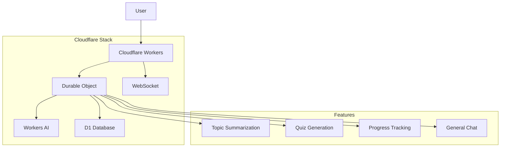

# Study Buddy Agent - Cloudflare AI Stack Demo

A comprehensive demonstration of Cloudflare's AI and compute stack, featuring an AI-powered study companion built with Workers, Durable Objects, Workers AI, and D1 Database.

[](https://deploy.workers.cloudflare.com/?url=https://github.com/your-username/studybot-cloudflare-agent)

## 🚀 Live Demo

**Try it now:** [https://studybot-agent.ssbhatti.workers.dev](https://studybot-agent.ssbhatti.workers.dev)

## 📚 What This Project Demonstrates

This project showcases the integration of multiple Cloudflare services in a real-world application:

### Core Cloudflare Services Used

| Service | Purpose | Implementation |
|---------|---------|----------------|
| **Cloudflare Workers** | Runtime environment | Main application entry point |
| **Durable Objects** | Stateful compute | Persistent chat sessions and user state |
| **Workers AI** | AI/ML inference | Llama 3.1 for natural language processing |
| **D1 Database** | SQLite database | User progress and quiz storage |
| **WebSocket** | Real-time communication | Live chat interface |

### Key Features

- 🤖 **AI-Powered Chat**: Natural conversations using Llama 3.1
- 📖 **Topic Summarization**: Generate educational summaries on any subject
- 🧠 **Quiz Generation**: Create multiple-choice quizzes with AI
- 📊 **Progress Tracking**: Study streak and performance analytics
- 💾 **Persistent Memory**: User state maintained across sessions
- 🔄 **Real-time Updates**: WebSocket support for instant responses

## 🏗️ Architecture Overview



## 🛠️ Technical Implementation

### 1. Cloudflare Workers (Main Runtime)

```typescript
// src/index.ts - Main entry point
export default {
  async fetch(request: Request, env: Env, ctx: ExecutionContext): Promise<Response> {
    // Handle WebSocket connections
    if (request.headers.get('Upgrade') === 'websocket') {
      const id = env.STUDYBOT_AGENT.idFromName('main');
      const obj = env.STUDYBOT_AGENT.get(id);
      return obj.fetch(request);
    }
    
    // Handle API endpoints
    if (url.pathname === '/api/chat' && request.method === 'POST') {
      // Route to Durable Object
    }
  }
};
```

**Key Concepts:**
- Stateless compute environment
- Request/Response handling
- WebSocket upgrade support
- Environment variable access

### 2. Durable Objects (Stateful Compute)

```typescript
// src/agent.ts - Durable Object implementation
export class StudyBotAgent {
  private db: D1Database;
  private state: DurableObjectState;
  private env: Env;

  async chat(message: string, userId: string): Promise<string> {
    // AI-powered conversation handling
    // State management
    // Database operations
  }
}
```

**Key Concepts:**
- Persistent state across requests
- WebSocket connection management
- Database operations
- AI integration

### 3. Workers AI Integration

```typescript
// AI-powered topic summarization
const response = await this.env.AI.run('@cf/meta/llama-3.1-8b-instruct-fast', {
  messages: [{ role: 'user', content: prompt }],
  max_tokens: 500,
  temperature: 0.7
});
```

**Key Concepts:**
- Model selection and configuration
- Prompt engineering
- Response handling
- Error management

### 4. D1 Database Operations

```typescript
// Database schema initialization
await this.db.exec(`
  CREATE TABLE IF NOT EXISTS user_states (
    user_id TEXT PRIMARY KEY,
    streak INTEGER DEFAULT 0,
    last_topic TEXT,
    last_active TEXT
  )
`);

// User state management
const userState = await this.getUserState(userId);
await this.updateUserState(userId, { streak: userState.streak + 1 });
```

**Key Concepts:**
- SQLite database operations
- Schema management
- Data persistence
- Query optimization

## 🚀 Quick Start

### Prerequisites

- Node.js 18+
- Wrangler CLI (`npm install -g wrangler`)
- Cloudflare account with Workers AI enabled

### 1. Clone and Install

```bash
git clone https://github.com/your-username/studybot-cloudflare-agent.git
cd studybot-cloudflare-agent
npm install
```

### 2. Configure Cloudflare

```bash
# Login to Cloudflare
wrangler login

# Create D1 database
wrangler d1 create studybot-db

# Update wrangler.toml with your database ID
```

### 3. Deploy

```bash
# Deploy to Cloudflare Workers
wrangler deploy

# Or use the deployment script
./deploy.sh
```

### 4. Test

```bash
# Run comprehensive tests
node test.js https://your-worker-url.workers.dev

# Or visit the test page
open test-page.html
```

## 📖 Usage Examples

### API Endpoints

#### Chat with the Agent

```bash
curl -X POST https://your-worker.workers.dev/api/chat \
  -H "Content-Type: application/json" \
  -d '{"message":"summarize machine learning","userId":"user123"}'
```

#### Generate a Quiz

```bash
curl -X POST https://your-worker.workers.dev/api/chat \
  -H "Content-Type: application/json" \
  -d '{"message":"quiz me on calculus","userId":"user123"}'
```

#### Check Progress

```bash
curl -X POST https://your-worker.workers.dev/api/chat \
  -H "Content-Type: application/json" \
  -d '{"message":"show my progress","userId":"user123"}'
```

### WebSocket Connection

```javascript
const ws = new WebSocket('wss://your-worker.workers.dev');

ws.onopen = () => {
  ws.send(JSON.stringify({
    message: "Hello!",
    userId: "user123"
  }));
};

ws.onmessage = (event) => {
  const data = JSON.parse(event.data);
  console.log('Response:', data.response);
};
```

## 🧪 Testing and Development

### Test Endpoints

- `GET /api/test/types` - Test type availability
- `GET /api/test/ai` - Test AI integration
- `GET /api/test/database` - Test database operations
- `GET /api/test/all` - Run all tests

### Development Workflow

```bash
# Start local development server
wrangler dev

# Run tests
npm test

# Check logs
wrangler tail

# Deploy to staging
wrangler deploy --env staging
```

## 📁 Project Structure

```
studybot-cloudflare-agent/
├── src/
│   ├── index.ts              # Main Worker entry point
│   ├── agent.ts              # Durable Object implementation
│   └── test-types.ts         # Test utilities
├── frontend/                 # Static frontend files
├── test-page.html           # Comprehensive test interface
├── wrangler.toml            # Cloudflare configuration
├── tsconfig.json            # TypeScript configuration
├── package.json             # Dependencies
└── README.md               # This file
```

## 🔧 Configuration

### Environment Variables

```toml
# wrangler.toml
[ai]
binding = "AI"

[[d1_databases]]
binding = "DB"
database_name = "studybot-db"
database_id = "your-database-id"

[[durable_objects.bindings]]
name = "STUDYBOT_AGENT"
class_name = "StudyBotAgent"
```

### TypeScript Configuration

```json
{
  "compilerOptions": {
    "lib": ["ES2022", "WebWorker"],
    "types": ["./worker-configuration.d.ts"]
  }
}
```

## 🎯 Learning Objectives

This project demonstrates:

1. **Cloudflare Workers Fundamentals**
   - Request/Response handling
   - Environment variables
   - WebSocket support

2. **Durable Objects**
   - Stateful compute
   - WebSocket management
   - Persistent state

3. **Workers AI Integration**
   - Model selection
   - Prompt engineering
   - Response handling

4. **D1 Database**
   - Schema design
   - CRUD operations
   - Data persistence

5. **Full-Stack Development**
   - API design
   - Error handling
   - Testing strategies

## 🚀 Advanced Features

### Custom AI Models

```typescript
// Use different models for different tasks
const summaryModel = '@cf/meta/llama-3.1-8b-instruct-fast';
const quizModel = '@cf/meta/llama-3.1-8b-instruct-fast';
```

### Database Migrations

```typescript
// Schema versioning
[[migrations]]
tag = "v1"
new_sqlite_classes = ["StudyBotAgent"]
```

### Error Handling

```typescript
try {
  const response = await this.env.AI.run(model, options);
  return response.response;
} catch (error) {
  console.error('AI Error:', error);
  return 'Sorry, I encountered an error. Please try again.';
}
```

## 📊 Performance Considerations

- **Cold Start Optimization**: Efficient initialization
- **Database Queries**: Optimized SQL operations
- **AI Response Caching**: Reduce redundant API calls
- **WebSocket Management**: Connection pooling
- **Error Recovery**: Graceful degradation

## 🔒 Security Best Practices

- Input validation and sanitization
- SQL injection prevention
- Rate limiting implementation
- User data privacy
- Secure WebSocket connections

## 🤝 Contributing

1. Fork the repository
2. Create a feature branch
3. Make your changes
4. Add tests
5. Submit a pull request

## 📄 License

MIT License - see [LICENSE](LICENSE) file for details

## 🙏 Acknowledgments

- Cloudflare for providing the amazing platform
- Meta for the Llama models
- The open-source community for inspiration

## 📞 Support

- [Cloudflare Workers Documentation](https://developers.cloudflare.com/workers/)
- [Workers AI Documentation](https://developers.cloudflare.com/workers-ai/)
- [D1 Database Documentation](https://developers.cloudflare.com/d1/)
- [Durable Objects Documentation](https://developers.cloudflare.com/durable-objects/)

---

**Built with ❤️ using Cloudflare's AI stack**